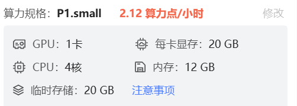

### 1. 下载模型权重
`git clone https://www.modelscope.cn/Qwen/Qwen-1_8B-Chat.git`

### 2. 更新权重的路径
```bash
model_path = "/gemini/pretrain"
python inference.py
```


### 3. finetune
环境准备：



安装依赖
`pip install -r requirements.txt`

修改finetune_lora_single_gpu.ipynb中 模型路径 微调数据的路径
依次运行单元格


