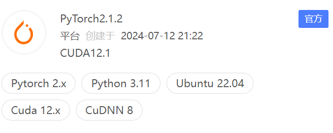

### 1. 下载模型权重
`git clone https://www.modelscope.cn/Qwen/Qwen-1_8B-Chat.git`

### 2. 更新权重的路径
```bash
model_path = "/gemini/pretrain"
python inference.py
```


### 3. finetune
环境准备：



- 显存的大小设置成20G
- pytorch的版本设置成2.1.2

安装依赖
```commandline
conda install gcc_linux-64 -y
pip install mpi4py
pip install -r requirements.txt
```


修改finetune_lora_single_gpu.ipynb
```commandline
--model_name_or_path "/gemini/pretrain"\
--data_path  "../qwen.json"\
--deepspeed r'ds_config_zero2.json' \
--output_dir "output_qwen" 
```
运行单元格

查看GPU信息
```commandline
nvidia-smi
```
大概需要22846MiB 22G的显存

--output_dir "output_qwen" 这个参数没起作用 py代码里面暂时写死

lora微调之后


lora与basemodel合并之后
tokenizer也一起合入


推理调用
```python
from transformers import AutoModelForCausalLM, AutoTokenizer
from transformers.generation import GenerationConfig

tokenizer = AutoTokenizer.from_pretrained("./output_qwen_merged", trust_remote_code=True)
model = AutoModelForCausalLM.from_pretrained(
    "./output_qwen_merged",
    device_map="auto",
    trust_remote_code=True
).eval()

response, history = model.chat(tokenizer, "你好", history=None)
print(response)
```
```commandline
Warning: import flash_attn rotary fail, please install FlashAttention rotary to get higher efficiency https://github.com/Dao-AILab/flash-attention/tree/main/csrc/rotary
Warning: import flash_attn rms_norm fail, please install FlashAttention layer_norm to get higher efficiency https://github.com/Dao-AILab/flash-attention/tree/main/csrc/layer_norm
Warning: import flash_attn fail, please install FlashAttention to get higher efficiency https://github.com/Dao-AILab/flash-attention
Loading checkpoint shards: 100%|██████████| 2/2 [00:06<00:00,  3.35s/it]
你好！有什么我能为你效劳的吗？
```


