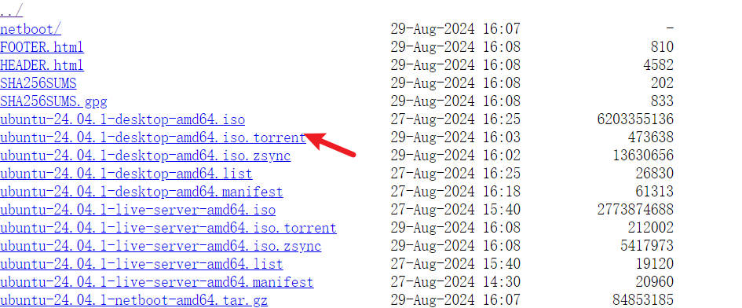
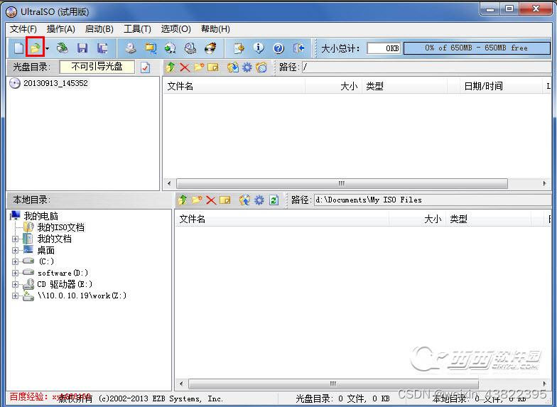
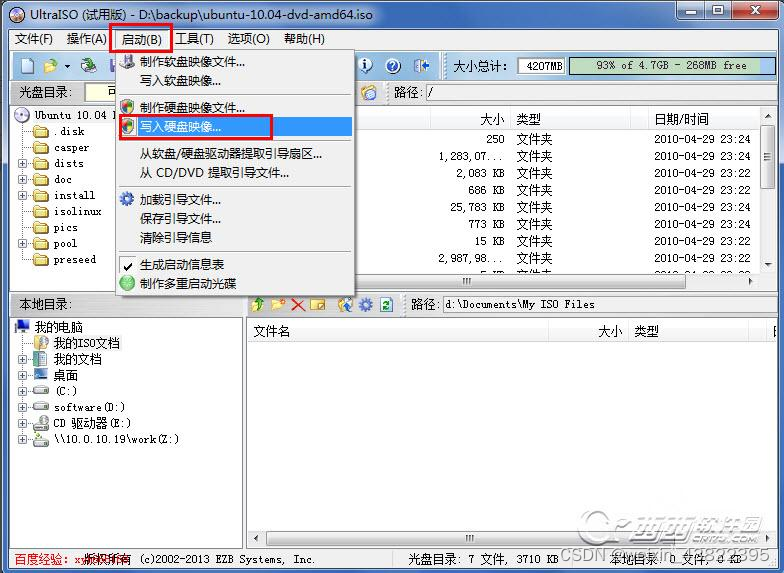
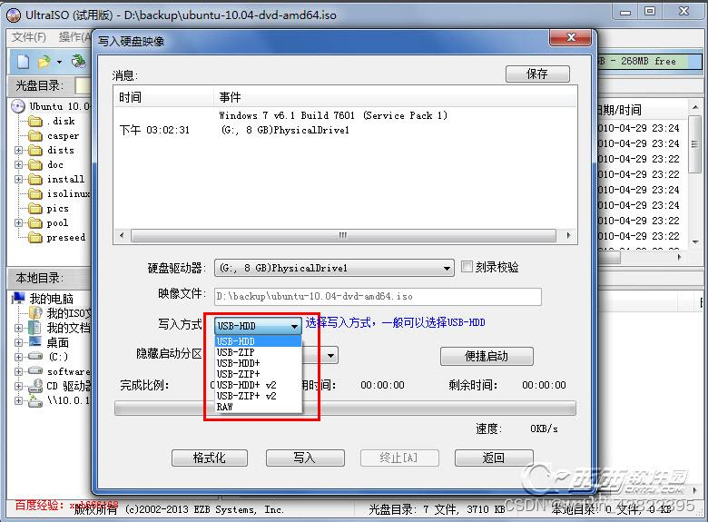

[TOC]

[参考1](https://blog.csdn.net/weixin_43822395/article/details/123889195)

## 1. 文件准备

ultraiso工具：
https://www.ultraiso.net/xiazai.html

ubantu 24.04iso镜像
https://ftp.sjtu.edu.cn/ubuntu-cd/24.04/  直接下载会比较慢
https://ftp.sjtu.edu.cn/ubuntu-cd/24.04/ubuntu-24.04.1-desktop-amd64.iso.torrent  # 使用迅雷工具打开这个种子下载会比较快

# 2. u盘制作
注意：准备一个u盘 如果里面有东西请备份到别处

## 2.1 使用ultraiso工具导入ubantu24.04 iso文件

## 2.2 写入u盘
写入方式选择usb+hdd

## 3 安装
[参考](https://www.php.cn/faq/775798.html)